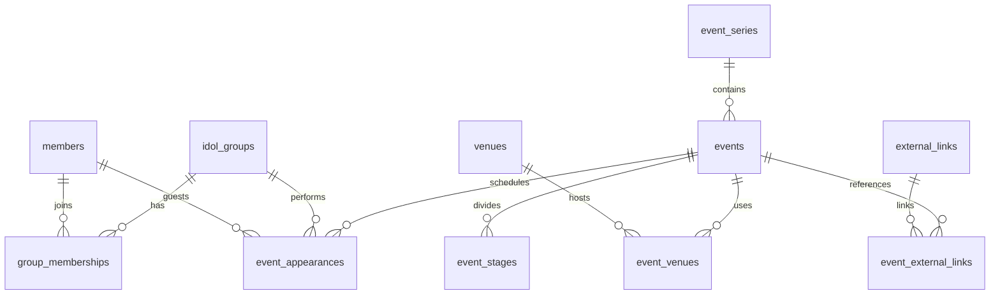

# 地下アイドルカレンダー

複数の地下アイドルのライブ予定を1つのカレンダーで確認できるOSSアプリを目指すプロジェクトです。

現在はOSS運用、Cloudflareデプロイ、Supabase PostgreSQLのデータモデルと検索検証までを整備しています。カレンダー画面と公開APIはまだ実装していません。

## 現在の構成

- 実行環境: Cloudflare Workers
- データベース: Supabase PostgreSQL（migrationはSupabase CLIで管理）
- 言語: TypeScript
- インフラ管理: Terraform（Cloudflareリソース）とWrangler（Workerコード）
- 統合ブランチ: `development`（ステージング）
- 本番ブランチ: `main`（本番）
- 開発フロー: 1 Issue・1 Pull Request

## ローカル開発

Node.js 24とTerraform 1.15系を用意してください。

```bash
npm ci
npm run dev
```

主な検証コマンド:

```bash
npm run check
```

DBを含むローカル検証にはDockerが必要です。

```bash
npm run db:start
npm run db:reset
npm run db:test
npm run db:types:check
```

ローカル用の秘密情報は`.dev.vars`へ保存してください。このファイルはGit管理されません。

## 最小Worker API

- `GET /`: 準備中メッセージ
- `GET /health`: 実行環境を含むhealth response
- その他のパス: JSON形式の404

## データベース

ブラウザはSupabaseへ直接接続せず、将来実装するCloudflare Worker APIだけを呼び出します。DB定義の正は[`supabase/migrations`](supabase/migrations)、詳細設計とベンチマークは[`docs/db`](docs/db/README.md)です。



主要テーブル:

- `idol_groups`、`members`、`group_memberships`: グループ、メンバー、期間付き所属履歴
- `event_series`、`events`: イベントシリーズと具体的な開催回
- `venues`、`event_venues`、`event_stages`: 複数会場・複数ステージ
- `event_appearances`: グループまたは個人の出演枠とタイムテーブル
- `external_links`: Xプロフィール・投稿、公式、チケット、配信URL

検索はNFKC・大小文字・空白・ひらがな／カタカナを正規化し、`pg_trgm`と通常索引を使います。1文字は拒否、2文字は完全・前方一致、3文字以上は別名を含む部分一致です。

## コントリビューション

変更を始める前にIssueを作成し、合意した1件のIssueに対して1件のPRを作成してください。詳しくは[CONTRIBUTING.md](CONTRIBUTING.md)を参照してください。

- 質問・相談: GitHub Discussions
- バグ・機能提案・作業: GitHub Issues
- 脆弱性: GitHubのPrivate Vulnerability Reporting

## ライセンス

[MIT License](LICENSE)で公開しています。著作権表示とライセンス文を保持することで、利用、改変、再配布、商用利用ができます。
