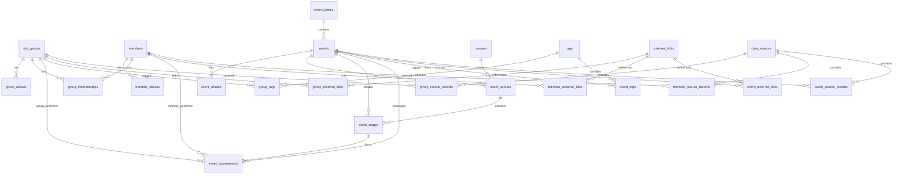

# データベース設計

## 責務と境界

- Supabase PostgreSQLはグループ、メンバー、イベント、検索索引を保持する。
- Cloudflare Workerは将来の唯一の公開API境界とし、ブラウザへSupabase接続情報を渡さない。
- `app` schemaはSupabase Data APIの公開schemaに含めず、`PUBLIC`、`anon`、`authenticated`の権限を剥奪する。
- DB定義の正は[`supabase/migrations`](../../supabase/migrations)とし、Dashboardでschemaを直接編集しない。
- 画像、X投稿本文、動画などのコンテンツはDBへ複製せず、外部URLと必要最小限の識別情報だけを保存する。

## ER図

## テーブル

### グループとメンバー

| テーブル            | 用途                                               | 主な制約                             |
| ------------------- | -------------------------------------------------- | ------------------------------------ |
| `idol_groups`       | グループの正式名、活動状態、公開状態、結成・解散日 | merge時だけ`merged_into_id`必須      |
| `group_aliases`     | 旧名、略称、表記違い                               | グループ内の正規化名を一意化         |
| `members`           | 公開用のステージ名と活動状態                       | 生年月日など不要な個人情報は持たない |
| `member_aliases`    | 旧名、読み、表記違い                               | メンバー内の正規化名を一意化         |
| `group_memberships` | メンバーとグループの期間付き所属                   | `active_until >= active_from`        |

所属は多対多かつ履歴を保持する。メンバー指定のイベント検索では、イベント開催日が所属期間内にあるグループ出演と、メンバー本人の個人出演を対象にする。

### イベント、会場、出演枠

| テーブル            | 用途                               | 主な制約                                       |
| ------------------- | ---------------------------------- | ---------------------------------------------- |
| `event_series`      | 定期公演、ツアー、フェスのまとまり | 開催回とは分離                                 |
| `events`            | 具体的な開催回                     | 開催日は必須、開場・開始・終了時刻は未定を許容 |
| `event_aliases`     | イベント名の略称・表記違い         | イベント内の正規化名を一意化                   |
| `venues`            | 会場、都道府県、市区町村、座標     | 都道府県コードは`01`〜`47`                     |
| `event_venues`      | 1イベントと複数会場の関連          | primary、secondary、onlineを区別               |
| `event_stages`      | 会場内ステージ                     | 同じイベントの`event_venue`だけ参照可能        |
| `event_appearances` | グループ・個人の出演枠             | `group_id`と`member_id`は必ず片方だけ          |

`events.start_date`と`end_date`は日付だけ判明した告知にも対応する。時刻が判明したら`doors_at`、`starts_at`、`ends_at`を追加する。既定タイムゾーンは`Asia/Tokyo`で、時刻値は`timestamptz`として保存する。

公開状態は`draft`、`published`、`archived`、重複統合用の`merged`を使用する。開催状態は`scheduled`、`postponed`、`cancelled`、`completed`として別管理する。

### タグ、外部リンク、出典

| テーブル                           | 用途                                      | 主な制約                         |
| ---------------------------------- | ----------------------------------------- | -------------------------------- |
| `tags`、`group_tags`、`event_tags` | ジャンルや企画などの柔軟な分類            | slugを一意化                     |
| `external_links`                   | X、公式、チケット、配信リンク             | canonical URLを一意化            |
| `*_external_links`                 | リンクと各entityの関連                    | relation typeとprimaryを保持     |
| `data_sources`                     | 手入力、X、公式、チケットサイト等の取得元 | trust levelは0〜100              |
| `*_source_records`                 | 出典URL、外部キー、取得・確認日時         | entityごとに外部キー整合性を保証 |

X投稿はURL、post ID、投稿者handle、投稿日時だけを保存する。本文、画像、動画は保存しない。合成データのURLは`example.invalid`または架空のXアカウントを使用する。

## 整合性と削除

- 親entityの削除で意味を失う別名、タグ、リンク関連は`ON DELETE CASCADE`とする。
- 出演履歴が参照するグループ、メンバー、会場は`ON DELETE RESTRICT`とし、通常は公開状態を`archived`または`merged`へ変更する。
- イベントとステージ、イベント会場の組み合わせは複合外部キーで一致を保証する。
- `updated_at`はtriggerで更新する。
- 公開状態と開催状態を分け、開催中止でも出典とイベント記録を削除しない。

## 関連文書

- [検索・フィルター設計](search-and-filter.md)
- [検索ベンチマーク](benchmark.md)
- [migration](../../supabase/migrations/20260816000000_create_calendar_schema.sql)
